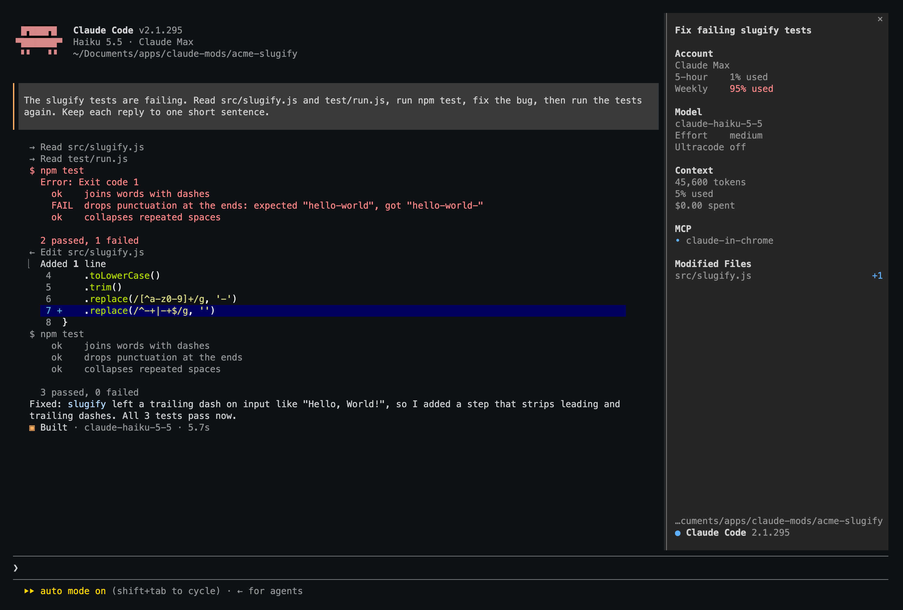

# opencode-style

A Claude Code mod that gives the terminal an [OpenCode](https://opencode.ai)-style layout, in Claude Code's own colours.



Unofficial: inspired by OpenCode's terminal UI, and not affiliated with or endorsed by Anthropic or the OpenCode project.

## What it changes

- **Your messages** sit on a panel behind a bar in the mode's colour: Claude orange, or the plan-mode colour in plan mode.
- **Claude's replies** are indented, without the `⏺` bullet.
- **Tool calls** are one-line rows, each call on its own row:
  `→ Read src/index.ts`, `← Edit app.ts`, `$ npm test`, `✱ Grep "foo"`, `◈ Search "query"`, `◉ Explore Task`, `⚙ server tool`.
  When Claude Code groups calls together (reads, searches, listings), each grouped row shows its own shell output or error. A command on its own keeps Claude Code's result block, which ctrl+o expands. File edits keep Claude Code's diff.
- **Each reply ends with** `▣ Built · model · 3.2s`, or `Planned` for a reply in plan mode, in place of `Baked for 3s`.
- **The spinner** says what's happening, with Claude Code's own timer and token count: Thinking, Writing, Running, Preparing.
- **A session sidebar** shows:
  - a title for the session
  - your plan and its 5-hour and weekly usage (and your email, if you turn it on)
  - the model, its effort level, and whether ultracode is on. Effort shows `—` until your first reply or `/effort`; ultracode follows what `/effort` reports, as in `/effort ultracode` and `/effort ultracode off`
  - context tokens, how full it is, and cost
  - connected MCP servers
  - Claude's todo list
  - the files Claude edited, with lines added and removed

  Long lists end with `+N more`: click it, or press Enter on it after ctrl+x tab, to show the rest, and `Show less` to fold it back.

Colours come from your Claude Code theme, so `/theme` still decides them.

## What it can't change

Claude Code doesn't let a mod redraw the input box, the welcome logo, permission prompts, the hint line under the input, or the background-task display below the input, so those stay as Claude Code draws them.

## Requirements

- Claude Code 2.1.294 or later. The mod API is in early access and can change between releases.
- For the sidebar to sit beside the chat: the fullscreen layout (`/tui fullscreen`) and a terminal at least 144 columns wide for it to open by itself. Elsewhere, `/sidebar` opens it above the input.

## Install

At the Claude Code prompt:

```
/plugin install opencode-style --marketplace nenwam/opencode-style
```

Answer `y` to add the marketplace, then choose a scope (user scope applies it everywhere).

## Use

- `/sidebar` shows or hides the sidebar. Closing it keeps it closed for the session.
- Settings are in `/config`; type `opencode` to find them:

| Setting | Default | What it does |
|---|---|---|
| Open the sidebar automatically | on | Docks the sidebar when the fullscreen layout starts |
| Name sessions with Haiku | on | Haiku writes a short session title from your first message: one small request per session, which counts toward your usage. Off, the title is your first message's first line |
| Show the account email in the sidebar | off | Off so a shared or recorded screen doesn't show it |
| List every tool call on its own row | on | Off, runs of reads and searches stay folded into Claude Code's summary line |
| Restyle your messages and Claude's replies | on | The panel and bar, and replies without the bullet |
| Draw tool calls as one-line rows | on | The icon rows above |
| End each reply with the Built footer | on | `▣ Built · model · time` |
| Plain spinner words | on | Thinking, Writing, Running, Preparing |
| ASCII icons | off | Plain characters in place of `▣ ✱ ◈ ◉` for fonts that lack them |

## Turning it off

- One piece at a time: the settings above.
- For one session: start with `claude --safe-mode`, which turns off every mod.
- For good: uninstall it from `/plugin`.

## Privacy

- The mod reads your email and plan from Claude Code's config file (`~/.claude.json`), or from `claude auth status` if that file doesn't have them. They stay on your machine.
- It reads the session's context, cost and usage from Claude Code, follows tool calls to list todos and edited files, and reads what `/effort` prints. It doesn't change what Claude is sent or what any tool does.
- The only network request it makes is the optional session-title request to Haiku, through Claude Code's own connection. It writes no files and sends no telemetry.

## Compatibility

- Tested on macOS with Claude Code 2.1.294. **Linux and Windows are not tested.**
- Tested with Claude Code's built-in dark theme. Other themes should work, since every colour is a theme colour, but haven't been checked.
- The desktop app and VS Code are left as they are: the transcript changes apply to the terminal only.

## Development

```
claude --plugin-dir .          # run Claude Code with the mod loaded from this folder
claude plugin validate .       # check the manifest and hooks module
claude plugin test .           # run tests/*.test.tsx
```

Claude Code writes the API's type declarations into `.claude-plugin/types/` the first time it loads the mod from this folder; after that, `tsc -p .` type-checks it.

## License

MIT
